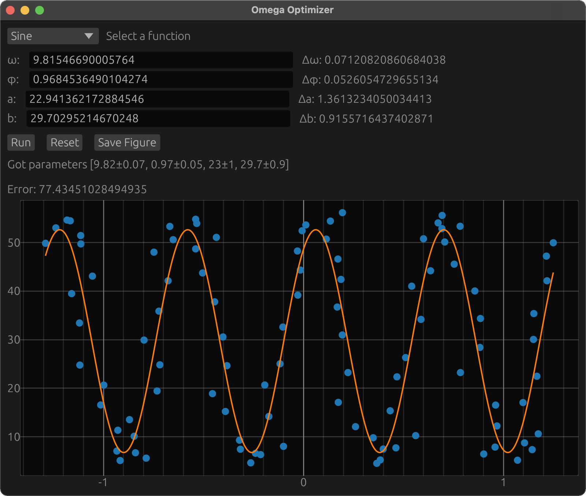
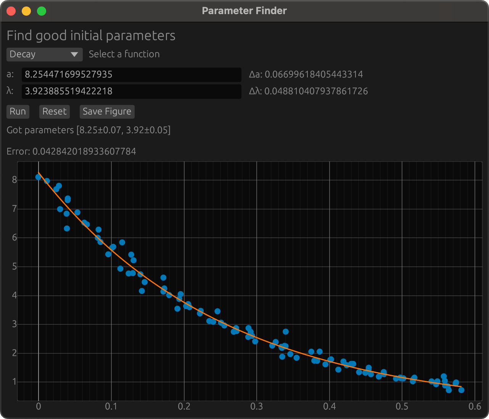

# Omega Optimizer

*Omega Optimizer* is a program that finds the parameters such that a parametrized function best matches some data. It uses a gui where you can see your data, choose from several parameterized functions, run the optimizer, and save the result as a figure. I have written a blog post on how this program works, which you can read on [my website](http://blog.emilie.moe/omega_optimizer/).

<p align="center">

</p>

## Usage

The program is run using `cargo run --release -- <datafile>`, where `<datafile>` is the path to a plain text file with x-values in the first column and y-values in the second column, with the values separated by a space. The program can also be ran without the gui using the `-f` flag. In this case, you must also provide a function. To print a list of available functions, use the `-p` flag. For more options, see the `-h` flag.

## Adding a new function

*Omega Optimizer* currently has 6 functions to choose from. If none of them matches your dataset, you can easily add a new function by following these steps:

1. Calculate the gradient and hessian of your function with respect to its parameters. 
2. Create a new rust file in `src/functions` where you create a new struct named after your function.
3. Derive the `Differentiated<D>` trait for your struct, where D is the number of parameters.
4. In `src/functions/mod.rs`, you will find an evocation of the `create_function_enum` macro. There, add a new line of the form `filename::StructName<D>`.

And now your function should be available as an option in the function list. To ensure you have implemented the gradient and hessian correctly, simply run `cargo test`, which tells you all indices that are implemented incorrectly.

For example, let's implement an exponential decay given by $f(x; a, \lambda) = ae^{-\lambda x}$. We first calculate the gradient and hessian:

$$\nabla f = \begin{bmatrix}
1 \\
-ax
\end{bmatrix}e^{-\lambda x},
\ \ 
\mathbf{H}f = \begin{bmatrix}
0 & -x \\
-x &  ax^2
\end{bmatrix}e^{-\lambda x}.$$

We then create the file `src/functions/decay.rs`, where we define the `Decay` struct and implement `Differentiated<2>` for it, giving us:

```rust
use nalgebra::{Matrix2, Vector2};

use super::Differentiated;

pub struct Decay;

impl Differentiated<2> for Decay {
    const PARAMETER_NAMES: [&'static str; 2] = ["a", "λ"];
    const NAME: &'static str = "decay";

    fn f(x: f64, params: &Vector2<f64>) -> f64 {
        let (a, l) = (params.x, params.y);
        a * (-l * x).exp()
    }

    fn grad(x: f64, params: &Vector2<f64>) -> Vector2<f64> {
        let (a, l) = (params.x, params.y);
        let exp = (-l * x).exp();
        Vector2::new(1.0, -a * x) * exp
    }

    fn hess(x: f64, params: &Vector2<f64>) -> Matrix2<f64> {
        let (a, l) = (params.x, params.y);
        let exp = (-l * x).exp();
        Matrix2::new(0.0, -x, -x, a * x * x) * exp
    }
}
```

We then add `decay::Decay<2>` to `create_function_enum`, and now the function is available through the gui:

<p align="center">

</p>
