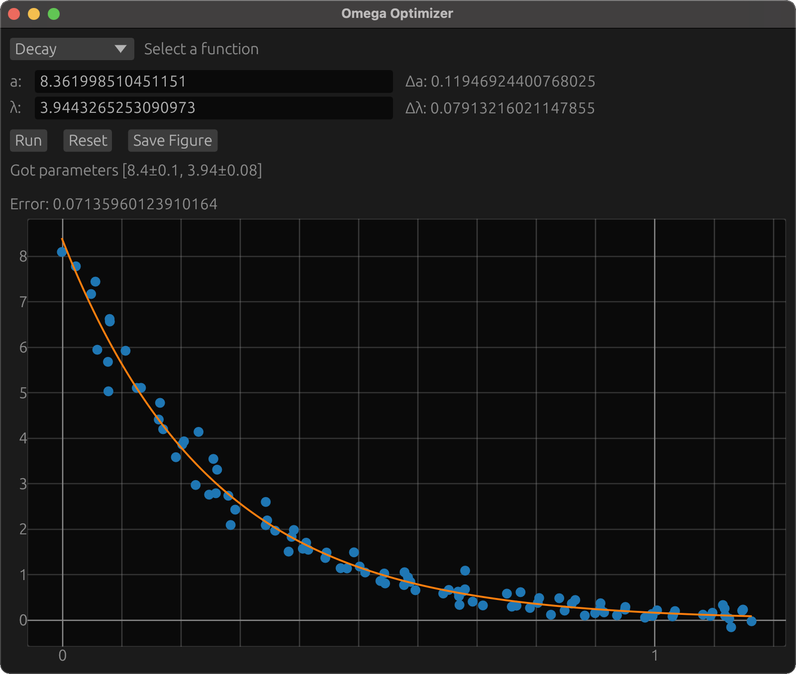

# Omega Optimizer

*Omega Optimizer* is a program that finds the parameters such that a parametrized function best matches some data. It uses a gui where you can see your data, choose from several parameterized function, run the optimizer and save the result as a figure.


## Adding a new function

*Omega Optimizer* currently has 6 functions to choose from. If none of them matches your dataset, you can easily add a new function *Omega Optimizer* by following these steps:

1. Calculate the gradient and hessian with of your function with respect to its parameters. 
2. Create a new file in `src/functions`, where you create a new struct named after your function.
3. Derive the `Differentiated<D>` trait for your struct, where D is the number of parameters.
4. In `src/functions/mod.rs`, you will find a evocation of the `create_function_enum` macro. There, add a new line on the form `filename::StructName<D>`.

And now your function should be available to choose from in the function list. To ensure you have implemented the gradient and hessian correctly, simply run `cargo test`, which will tell you the index where you made an error.

For example, let's implement an exponential decay given by $f(x; a, \lambda) = ae^{-\lambda x}$. We first calculate the gradient and hessian:
$$
    \nabla f = \begin{bmatrix}
    1 \\
    -ax
    \end{bmatrix}e^{-\lambda x},\ 
    \mathbf{H}f = \begin{bmatrix}
    0 & -x \\
    -x &  ax^2
    \end{bmatrix}e^{-\lambda x}.
$$

We then create the file `src/functions/decay.rs`, where we define the `Decay` struct and implement `Differentiated<2>` for it, giving us:

```rust
use nalgebra::{Matrix2, Vector2};

use super::Differentiated;

pub struct Decay;

impl Differentiated<2> for Decay {
    const PARAMETER_NAMES: [&'static str; 2] = ["a", "λ"];
    const NAME: &'static str = "decay";

    fn f(x: f64, params: &Vector2<f64>) -> f64 {
        let (a, l) = (params.x, params.y);
        a * (-l * x).exp()
    }

    fn grad(x: f64, params: &Vector2<f64>) -> Vector2<f64> {
        let (a, l) = (params.x, params.y);
        let exp = (-l * x).exp();
        Vector2::new(1.0, -a * x) * exp
    }

    fn hess(x: f64, params: &Vector2<f64>) -> Matrix2<f64> {
        let (a, l) = (params.x, params.y);
        let exp = (-l * x).exp();
        Matrix2::new(0.0, -x, -x, a * x * x) * exp
    }
}
```

We then add `decay::Decay<2>` to `create_function_enum`, and now the function is available through the gui:

